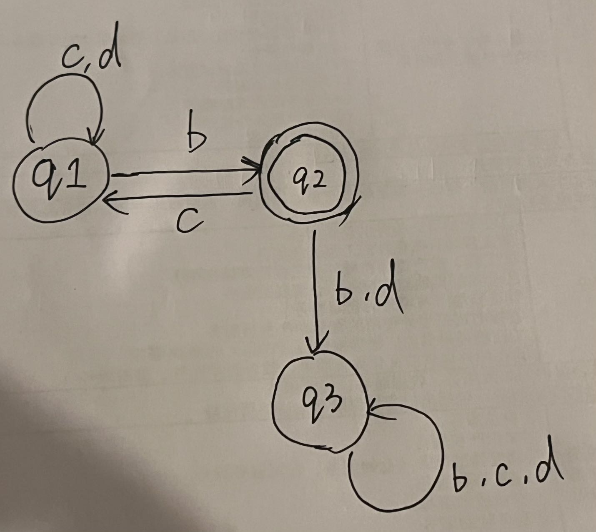
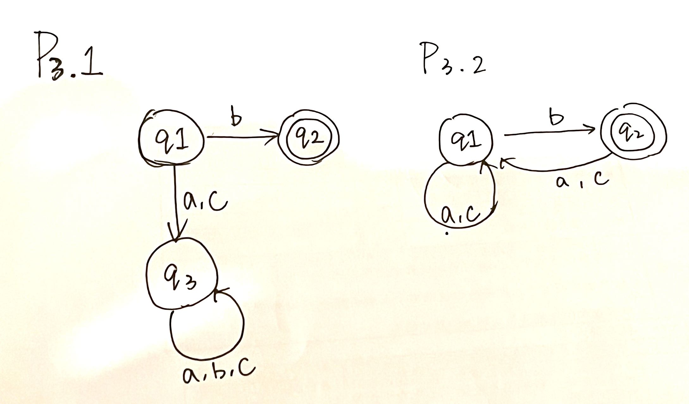
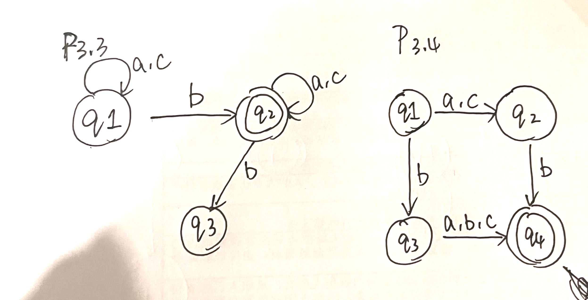
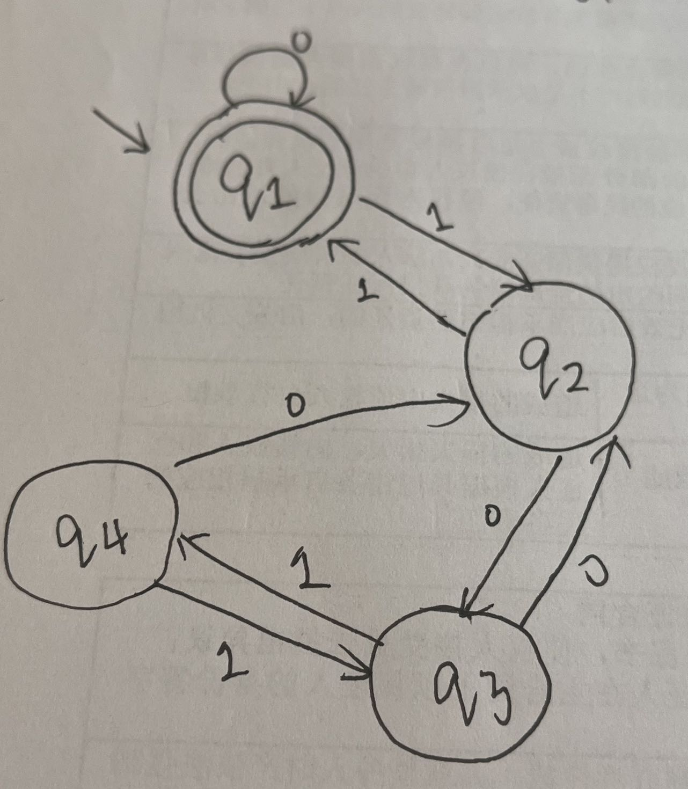
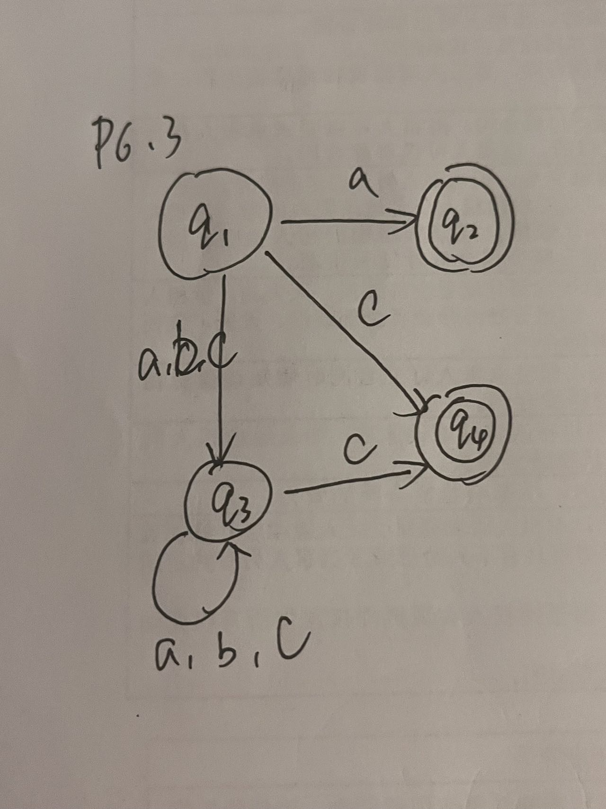
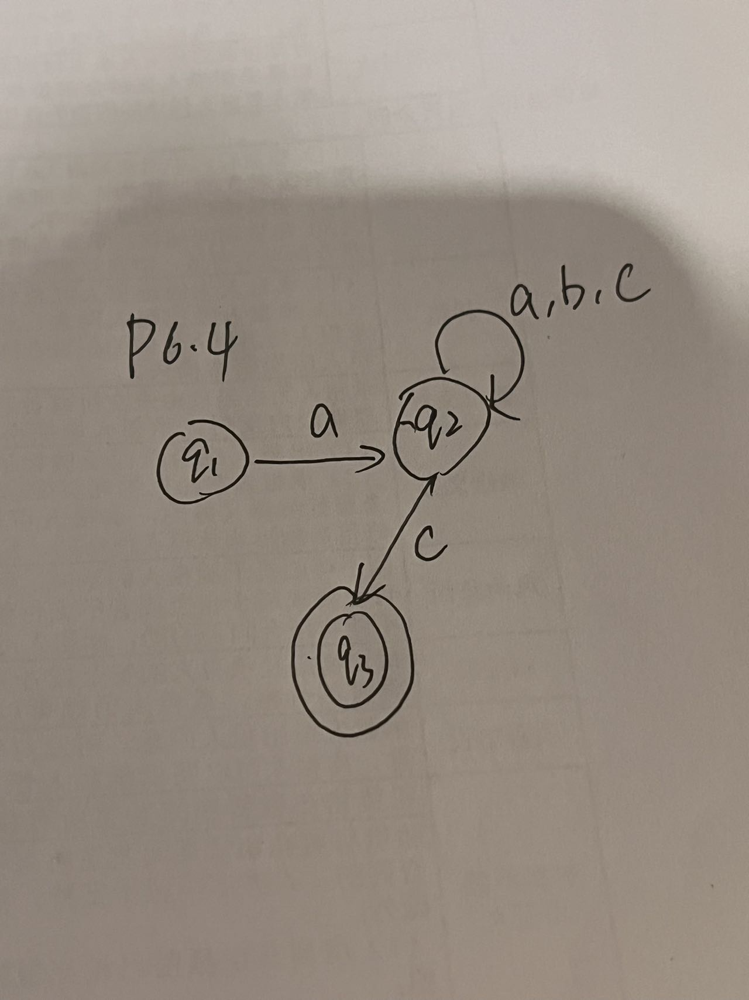

# Tutorial 2
### P1
**Let $\sum = \{a,b\}$. Write the regular expression for the following:**

- [x] 5. The set of strings that do not contain $ab$ as a substring.
	$b^{*}a^{*}$
- [x] 6. The set of strings not equal to $ab$

- [x] 7. The set of strings not containing $bab$ as a substring (hard).
	$a^{*} (ba^{2}a^{*} | b^{*})^{*} a^{*}$

### P2
**Let $\sum = \{0,1\}$
Write English descriptions for the language of each of the following regular expressions:

- [ ] $\sum^{*}1\sum\sum$ 
	a set of strings whose third symbol from right is 1
- [x] $(\sum\sum\sum)^{*}$ 
	A string whose length is a multiple of 3
- [x] $(\sum^*0\sum^*1\sum^*)|(\sum^*1\sum^*0\sum^*)$
	A string containing at least one 1 and at least one 0
- [x] $(1^∗01^∗01^∗0)^∗1^∗$ 
	A string that has a number of 0s that is a multiple of 3.
- [ ] $(0^∗10)^∗0^∗110^∗(010^∗)^∗$ 
	???

### P3
For each of the following three languages over Σ = {a, b}, provide a regular expression for the language.

- [x] 1. The set of strings that contain $abbab$, in that order, but not necessarily con- secutively. Said differently, the set of strings such that one can delete some amount of letters, possibly zero, to obtain $abbab$. For example, $aaababaababba$ is in the language, while $bbbababbbaa$ is not.
	$\sum^*a\sum^*b\sum^*b\sum^*a\sum^*b\sum^*$

### P5 
something about pattern matching, potentially will be mentioned in the next week.

### P6 ? 
Let $\sum = \{a,b\}$. For each of the following regular expressions,provide a clear and concise English description for the language of that regular expression. No justification is necessary

- [x] $(a|b)^∗((aaa)|(bbb))(a|b)$  
	a set of strings whose 4nd,3rd and 2nd last letters are all the same

### P7
- [x] The set of strings that contain at most two b.
	$(a^* | a^* b a^* | a^*ba^*ba^*)$
	$a^*(b|\epsilon)a^*(b|\epsilon)a^*$
- [ ] The set of strings that have even length or contain no a, but not both.
	- have even length, contain a : 
	<mark style="background: #FF5582A6;">idea:</mark>  The length of substring before a is odd and the length of substring after a is even, or vice versa
	- have odd length, contain no a: $b(bb)^*$
- [ ] The set of strings that contain exactly two out of the four length 2 strings $(aa, ab, ba, bb)$ as substrings.
	 - $aa,ab$ : $a^*aab$  
	 - $aa,ba$ : $baaa^*$
	 - $aa,bb$ : does not exist
	 - $ab,ba$ : $aba$
	 - $ab,bb$ : $ab^*$
	 - $ba,bb$ : $b^*bba$
	$(a^*b | ba^* | aba | ab^* |b^*a)$
	
### P8
Give a recursive procedure that decides, given R, if L(R) is infinite. Explain why each case is correct. 
Hint: It is likely necessary to design a procedure that obtains and uses some additional information about the subexpressions beyond whether their languages are infinite. Be very careful with regards to edge cases, such as the empty set.
哥们逆天了

# Tutorial 3

### P1
(b)
- A set of strings that start with any number of as followed by any number of bs
- ??? $0^*1(1|0\Sigma)^*$ A set of strings that contain at least one '1' and do not end with an odd number of consecutive '0's
- ??? a set of strings whose last letter is 0 and that contain an odd number of 1 s

### P2

### P3

### P4
 

### P6

### P7

### P8
For DFAs $M_1,M_2$:

- $M_1: Q_1,\Sigma_1,\delta_1,q_0,F$
- $M_2: Q_2,\Sigma_2,\delta_2,q_0',F'$

(i) We need to construct a DFA $M$ such that: $L(M_1) \cup L(M_2) = L(M)$
$M: Q_1 \cup Q_2 , \Sigma_1 \cup \Sigma_2, \delta((q_1,q_2),\sigma),(q_0,q_0'),(f_1,f_2)$
Where $q_1 \in Q_1, q_2 \in Q_2, \sigma \in \Sigma_1 \cup \Sigma_2, f_1 \in F$ or $f_2 \in F'$

(ii) We need to construct a DFA $M$ such that: $L(M_1) \cap L(M_2) = L(M)$
$M: Q_1 \cup Q_2 , \Sigma_1 \cup \Sigma_2, \delta((q_1,q_2),\sigma),(q_0,q_0'),(f_1,f_2)$
Where $q_1 \in Q_1, q_2 \in Q_2, \sigma \in \Sigma_1 \cup \Sigma_2, f_1 \in F$ and $f_2 \in F'$

### P9

# Tutorial 5
### P6
$S \rightarrow MN$
$M \rightarrow \Sigma M \Sigma$
$N \rightarrow \Sigma N \Sigma$
$M \rightarrow 0$
$N \rightarrow 1$

## P7?

## P8
(1) Every rule either adds a 'a' and a 'b' , or maintains the numbers of 'a's and 'b's
(2) aabb ab bbaa

### P13
$S \rightarrow A$
$A \rightarrow NAN$
$A \rightarrow 0\#1 | 1\#0$
$\# \rightarrow N\#N$
$N \rightarrow A | B$

### P14
right regular ?
$A \rightarrow a$
$A \rightarrow c$
$A \rightarrow bB$
$b \rightarrow bB$
$B \rightarrow c$

left regular
$A \rightarrow a$
$A \rightarrow Bc$
$B \rightarrow \epsilon$
$B \rightarrow Bb$

### P16 ？

# Tutorial 6

### q3
#### My answer:
- 1. Initialize an empty set Z which stores all variables that can derive $\epsilon$
- 2. Go through every rule in R
	- If the RHS of the rule only contains variables in Z or a $\epsilon$ , add the variable into set Z
- 3. Repeat step 2 util there is no new variable added to Z
### q4
#### My answer:
- 1. apply the method in q3 to store all variables that can derive $\epsilon$ in set Z
- 2. Initialize an empty set M with initial variable $\{X\}$ which stores all variables that can derive X.
- 3. Go through every rule in R
	- if the RHS of the rule contains exactly 1 variable that in set M and other variables  are in set Z, then add the variable on the LHS to set X
	
- 4. Repeat step 3 util there is now new variable added to X 

# Tut9

## P2
$\frac{n^2}{2} + n + 1$

