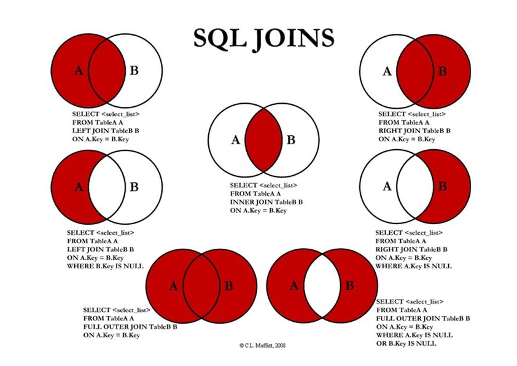

# Joins

## Natural Join
Put together rows, one from each table, in which the <mark style="background: #FF5582A6;">same-named columns</mark> have <mark style="background: #FF5582A6;">same values</mark>.

## Inner Join

```SQL
SELECT <selection list>
FROM R INNER JOIN S using(<list of attributes>)
```
equals to 
```SQL
SELECT <selection list>
FROM R JOIN S using(<list of attributes>)
```



# Correlated vs Noncorrelated Subqueries

## Noncorrelated Subqueries
- Do not depend on data from the outer query
- Execute once for the entire outer query

## Correlated Subqueries
- Make use of data from the outer query
- Execute once for each row of the outer query
- Can use the EXISTS operator

# EXISTS vs IN
## IN
The comparison operator IN compares a value $v$ with a set (or multi-set) of values $V$, and evaluates to true if $v$ <mark style="background: #FF5582A6;">is one of the elements</mark> in $V$

## EXISTS
`EXISTS` is used to check whether the result of a correlated nested query is <mark style="background: #FF5582A6;">empty (contains no tuples) or not</mark>


# Set Comparison

## ALL
tests whether a comparison is true for <mark style="background: #FF5582A6;">the whole set</mark>.

## SOME
tests whether a comparison holds for <mark style="background: #FF5582A6;">at least one set element</mark>
