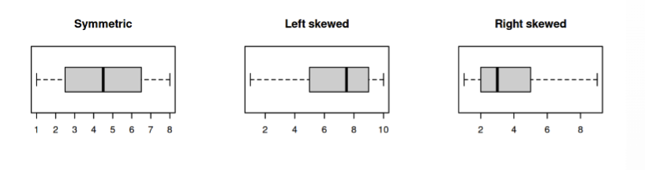
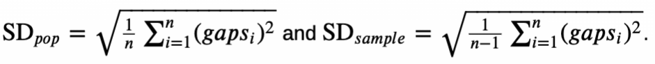
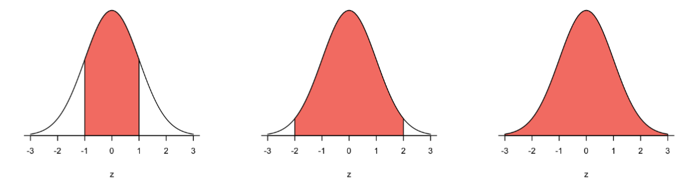

<style>
/* 修改目录的文字颜色和背景颜色 */
.toc {
    color: #ffffff; /* 白色文字 */
    background-color: #C29E64; /* 薰草黄背景 */
}

/* 修改目录项的悬停效果 */
.tocify-item:hover {
    color:rgb(90, 164, 74); /* 薰草黄文字 */
    background-color: #e0e0e0; /* 浅灰色背景 */
}

/* 修改当前激活目录项的背景颜色和文字颜色 */
.tocify-focus {
    color: #ffffff; /* 白色文字 */
    background-color: #4C7543; /* 松绿背景 */
}
</style>

# DATA&Graphical Summaries

## Read In Data
**header = TRUE**: The first row is treated as the **header row**, and the values in that row are used as column names.

**header = FALSE**: If you set header = FALSE, R will treat the first row as **regular data** and not as column names. In this case, R will automatically assign default column names such as V1, V2, V3, ...

```{r}
data = read.csv("data/2023fatalities.csv", header = TRUE)
```


## Initial data analysis (IDA)
### Definition
Data is **informaion** about the set of subjects being studied (like road fatalities). Most commonly, data refers to the **sample**, not the population.

**Initial data analysis** is a first general look at the data, without formally answering the research questions.

- IDA helps you to see whether the data can answer your research questions

- IDA may pose other research questions

- IDA can
  - identify the data’s main qualities
  - suggest the population from which a sample derives

### IDA commonly involves

Initial Data Analysis commonly involves:

  - data background: checking the quality and integrity of the data
  
  - data structure: what information has been collected?
  
  - data wrangling: scraping, cleaning, tidying, reshaping, splitting, combining
  
  - data summaries: graphical and numerical

## Identifying variables

### Number of variables

&nbsp;

| 1 variables | 2 variables | 2+ variables |
|----------|----------|----------|
| Univariate   | Bivariate   | Multivariate   |

### Types of variables


- **Qualitative or Categorical (Categories)**
  - **IN R: Factor or Character**
  - **Ordinal (ordered)**
    - Binary (2 categories)
    - 3+ categories
  - **Nominal (non-ordered)**
    - Binary (2 categories)
    - 3+ categories
- **Quantitative or Numerical (Measurements)**
  - **IN R: Numeric**
  - **Discrete**
    - R: Integer (int)
    - Binary (2 categories)
    - 3+ categories
  - **Continuous**
    - R: Double

### Change variable types in R

**Structure of Data**

```{r}
str(data, vec.len = 2)
```

**From Numerical to Categorical**
```{r}
# Change type of Variables 
data$Crash.ID = as.factor(data$Crash.ID) 
data$Month = as.factor(data$Month)

# 显示转化后数据的结构
# list.len 参数用于指定要显示的列表元素的最大数量。
# vec.len 参数用于指定要显示的向量元素的最大数量。
str(data, list.len = 5, vec.len = 2)
```

**From Categorical to Numerical**

```{r}
data$Speed.Limit = as.numeric(data$Speed.Limit)

# New structure of Data display the 5 variables using list.len 
# 第11到第15个变量
str(data[c(11, 12, 13, 14, 15)], vec.len = 2)
```


## Graphical summaries
这个还没教完,可以先看看

| **Variables**                       | **Graphical summaries**    | **Numerical summaries**              |
|-------------------------------------|----------------------------|--------------------------------------|
| **1 Qualitative**                   | Bar plot                   | Frequency table                      |
|                                     |                            | Most popular category                |
| **2 Qualitative**                   | Stacked bar plot           | Contingency table                    |
|                                     |                            | Most popular category                |
| **1 Quantitative**                  | Histogram                  | Mean, median, SD, IQR, range         |
|                                     | Boxplot                    |                                      |
| **2 Quantitative**                  | Scatter plot               | Linear model                         |
|                                     |                            | Correlation coefficient              |
| **1 Qualitative + 1 Quantitative**  | Side by side boxplot       |                                      |


### Barplot

**Step 1: Build the frequency table**
```{r}
# Select the DayWeek variable from the whole data frame 
Dayweek = data$Dayweek 

# Produce a frequency table of fatalities per day of the week 
table(Dayweek)

# Order days
Dayweek = factor(Dayweek, levels = c("Monday", "Tuesday", "Wednesday", "Thursday", "Friday", "Saturday", "Sunday"))
table(Dayweek)
```

**Step 2: Produce the barplot**
```{r}
barplot(table(Dayweek))
```


### Double barplot

```{r}
# Select DayWeek and Gender variables 
Dayweek = data$Dayweek 
Gender = data$Gender
# Produce a double frequency table (contingency table) 
data1 = table(Gender, Dayweek) 
data1
```
#### Stacked barplot
```{r}
barplot(data1, main = "Fatalities by Day of the Week and Gender", xlab = "Day of the week", col = c("red", "lightblue", "lightgreen", "orange"), legend = rownames(data1))

```


#### Side-by-side barplot

```{r}
barplot(data1, main = "Fatalities by Day of the Week and Gender", xlab = "Day of the week", col = c("red", "lightblue", "lightgreen", "orange"), legend = rownames(data1), beside = TRUE)
```

#### Side-by-side barplot ignoring ‘-9’, ‘M’, ‘U’ and ‘Unspecified

```{r}
barplot(data1[-c(1, 3, 5, 6), ], main = "Fatalities by Day of the Week and Gender", xlab = "Day of the week", col = c("lightblue", "lightgreen"), legend = rownames(data1[-c(1, 3, 5, 6), ]), beside = TRUE)
```


### Histogram

The frequency table can also be used to summarise a set of **quantitative** data, by collecting the datq into class intervals (or ‘bins’). A histogram highlights the frequency of data in one class interval compared to another.

```{r}
hist(data$Age, xlab = "Age", ylab = "Frequency", main = "Histogram for Age of Road Fatalities")
```

```{r}
# Select the variable Age 
Age = data$Age 
# Define end points for class intervals 
breaks = c(-10, 18, 25, 70, 101) 
# Build frequency table 
table(cut(Age, breaks, right = F))
```

```{r}
hist(Age, br = breaks, right = F, freq = F, xlab = "Age (years)", ylab = "Density", main = "Histogram for Age of Road Fatalities in Australia 1989-2023")
```

The area of each block represents the proportion of subjects in that particular class interval.

#### DATA Cleaning
It's better to replace the '-9' entries to NA 
```{r}
# Replacing the '-9' entries 
data$Age[data$Age == -9] = NA

hist(data$Age, br = breaks, freq = F, right = F, xlab = "Age", ylab = "Density", main = "Histogram for Age of Road Fatalities in Australia 1989-2023")
```

#### Details of density-scale histograms
The area of the whole histogram on the density scale is one (or, in percentage, 100%).

**area (proportion) of each block** = 

\[
\frac{\text{number of subjects in the class interval}}{\text{total number of subjects}}
\]

**height (density) of each block** = 

\[
\frac{\text{proportion of the block}}{\text{length of the class interval}}
\]

For continuous (quantitative) data, we need an endpoint convention for data points that fall on the border of two class intervals.

Number of class intervals

```{r}
Age = data$Age
par(mfrow = c(1, 2)) # This puts the graphic output in 1 row with 2 columns 

breaks = seq(0, 102, 2) 
hist(Age, br = breaks, freq = F, right = F, xlab = "Age", ylab = "Density")

breaks = c(0, 18, 25, 70, 101) 
hist(Age, br = breaks, freq = F, right = F, xlab = "Age", ylab = "Density")
```

#### Produce a histogram by hand

**Step 1**: Construct the distribution table.

| Class intervals | Number of subjects in the interval | %   | Height of block |
|-----------------|------------------------------------|------|-----------------|
| [0,18)          | 5747                               | 10.4 | 0.0058          |
| [18,25)         | 11541                              | 20.8 | 0.0298          |
| [25,70)         | 30566                              | 55.2 | 0.0123          |
| [70,101)        | 7504                               | 13.6 | 0.0044          |
| **Total**       | **55360**                          | **100** |                 |

**Step 2**: Draw the horizontal axis and blocks


**Quick Way In R** :

- freq=F produces the histogram on the density scale.

- right=F makes the intervals right-open

### Other graphical summaries

#### Scatter Plot 
```{r}
#### Scatter Plot 
Year = data$Year 
plot(Age, Year)
```

#### Heatmap

```{r}
heatmap(table(Age, Year), Rowv = NA, Colv = NA, scale = "none", main = "Heatmap of frequencies")
```

#### Boxplot

```{r}
Age = data$Age 
summary(Age)

par(mfrow = c(1, 2)) 
boxplot(Age) 
boxplot(Age, horizontal = T)
```


#### Comparitive box plots
```{r}
data$Gender = factor(data$Gender, levels = c("Female", "Male"))
Gender = data$Gender 
boxplot(Age ~ Gender, horizontal = T)
```


## Logical operators


| Symbol | Description                 |
|--------|-----------------------------|
| `>`    | greater than                |
| `>=`   | greater than or equal to    |
| `<`    | less than                   |
| `<=`   | less than or equal to       |
| `==`   | equal to                    |
| `!=`   | not equal to                |


# Numerical Summaries

## Import Data
```{r}
data = read.csv("data/NewtownJune2017.csv",header=T)
str(data)
```

## Notations 
Observations of a single variable of size \( n \) can be represented by

  \( x_1, x_2, \dots, x_n \)

The ranked observations (ordered from smallest to largest) are

  \( x_{(1)}, x_{(2)}, \dots, x_{(n)} \)

  such that \( x_{(1)} \leq x_{(2)} \leq \dots \leq x_{(n)} \)

The sum of the observations is

  \[
  \sum_{i=1}^{n} x_i
  \]

## Numerical Summaries Intro

A numerical summary reduces all the data to one simple number (“statistic”).

- This loses a lot of information

- However it allows easy communication and comparisons.

**Major features** that we can summarise numerically are:

- Maximum

- Minimum

- Centre[sample mean,median]

- Spread[standard deviation,range,interquartile range]


## Centre

### Sample Mean

The sample mean is the **average** of the data.

\[
\text{sample mean} = \frac{\text{sum of data}}{\text{size of data}}
\]

or

\[
\bar{x} = \frac{\sum_{i=1}^{n} x_i}{n}
\]

### Deviation from the mean

Given a data point \( x_i \), its deviation from the sample mean \( \bar{x} \) is

\[
D_i = x_i - \bar{x}
\]

### Sample mean as a balancing point

The sample mean is the point at which the data is **balanced** in the sense the sum of the **absolute deviations** for values to the left of the mean is the same as the sum of absolute deviations to the right of the mean.

\[
\sum_{x_i < \bar{x}} |x_i - \bar{x}| = \sum_{x_i > \bar{x}} |x_i - \bar{x}|
\]

### Sample mean on the histogram

The sample mean is the balancing point on the histogram: **the area of the histogram to the left of the mean equals the area to the right of the mean**.


```{r}
hist(data$Sold, main="Newtown properties", xlab="Price (in 1000s)") 

abline(v=mean(data$Sold),col="green")
```

```{r}
hist(data$Sold[data$Type=="House" & data$Bedrooms=="4"], main="Newtown 4 Bedrooms", xlab="Price (in 1000s)" )

abline(v=mean(data$Sold[data$Type=="House" & data$Bedrooms=="4"]),col="green")
```

### Sample median

The sample median \( \tilde{x} \) is the **middle data point**, when the observations are ordered from smallest to largest.

- For an odd-sized number of observations:

  \[
  \text{sample median} = \text{the unique middle point} = x_{\left(\frac{n+1}{2}\right)}
  \]

- For an even-sized number of observations:

  \[
  \text{sample median} = \text{average of the 2 middle points} = \frac{x_{\left(\frac{n}{2}\right)} + x_{\left(\frac{n}{2}+1\right)}}{2}
  \]


### Sample Median In R
(i)Sort and Observe
```{r}
sort(data$Sold)
length(data$Sold)
```
(28th + 29th)/2 = 1387.5

(ii)Directly use function `median()`
```{r}
median(data$Sold)
```

### Sample median on the histogram
The sample median is the **half way point** on the histogram - i.e., 50% of the houses sold are below and above $1.3875 million.

```{r}
hist(data$Sold) 
abline(v=mean(data$Sold),col="green")
abline(v=median(data$Sold),col="purple")
```

### Sample mean and median on the boxplot

**The sample median is the centre line on the boxplot.**

```{r}
boxplot(data$Sold[data$Type=="House" & data$Bedrooms=="4"], main = "Newtown 4B Properties") 

abline(h=mean(data$Sold[data$Type=="House" & data$Bedrooms=="4"]),col="green")

abline(h=median(data$Sold[data$Type=="House" & data$Bedrooms=="4"]),col="purple")
```

## Robustness

### Sample Mean vs Median
The difference between the sample mean and the sample median can be an indication of the **shape** of the data.

- For symmetric data, the sample mean and sample median are the same: \( \bar{x} = \tilde{x} \).

- For left skewed data (the most frequent data are concentrated on the right, with a left tail), the sample mean is smaller than the sample median: \( \bar{x} < \tilde{x} \).

- For right skewed data (the most frequent data are concentrated on the left, with a right tail), the sample mean is larger than the sample median: \( \bar{x} > \tilde{x} \).


```{r, echo=FALSE, out.width="100%", fig.align='center'}

```

### Optimal Choice

- As the **sample median is robust**, it is preferable for data which is skewed or has many outliers.

- The sample mean is helpful for data which is **basically symmetric**, with not too many outliers, and for theoretical analysis.

## Spread

### Standard deviation (SD)
**Root mean square (RMS)**

  \[
  \text{RMS(numbers)} = \sqrt{\text{sample mean}\left(\text{numbers}^2\right)}
  \]
  

The standard deviation measures the **spread** of the data.
  
  \[
  \text{SD}_{\text{pop}} = \text{RMS of (deviations from the mean)}
  \]
  
  Formally,
  
  \[
  \text{SD}_{\text{pop}} = \sqrt{\text{Mean of (deviations from the mean)}^2} = \sqrt{\frac{\sum_{i=1}^{n} (x_i - \bar{x})^2}{n}}
  \]

### Sd_pop vs Sd_sample

There are **two** different formulas for the standard deviation, depending on whether the data is the **population** or a **sample**.

The `sd` command in R always gives the **sample** version, as we most commonly have samples.

Formally,

```{r, echo=FALSE, out.width="100%", fig.align='center'}

```

| Summary                            | Formula                                     | In R                           |
|------------------------------------|---------------------------------------------|--------------------------------|
| **Population or Sample mean**      | Sample Mean (Average)                       | `mean(data)`                  |
| **Population standard deviation**  | RMS of gaps from the sample mean            | `sd(data) * sqrt((n-1)/n)`     |
| **Sample standard deviation**      | Adjusted RMS of gaps from the sample mean   | `sd(data)`                    |

The squared standard deviation is called the **variance**: \(\text{SD}^2\).

The population standard deviation is always smaller than a sample standard deviation, \(\text{SD}_{\text{pop}} \leq \text{SD}_{\text{sample}}\), why? Extra variability due to sampling.

*Note*: **For large sample sizes, the difference becomes negligible**

### Population data or Sample data ? 

If we are just interested in the Newtown property prices during April-June 2017, then the `data` is the whole population.

If we are studying the property prices during April-June 2017 as a **window into more general property prices** (for the rest of the year or for the Inner West area) , then the data could be considered a sample


### Standard Units (Z-score)

**Standard units of a data point** = how many standard deviations is it below or above the mean

\[
\text{standard units} = \frac{\text{data point} - \text{mean}}{\text{SD}}
\]

This means that

\[
\text{data point} = \text{mean} + \text{SD} \times \text{standard units}
\]

It gives the relative location of a data point in the data set. It also has other benefits in data modelling (see later lectures).


### Interquartile range

**IQR** = range of the middle 50% of the data

- More formally, **IQR** = \(Q_3 - Q_1\), where
  - \(Q_1\) is the 25% percentile (1st quartile) and \(Q_3\) is the 75% percentile (3rd quartile).
  - The median is the 50% percentile, or 2nd quartile \(\tilde{x} = Q_2\).

### Quantile, quartile, percentile

The set of **q-quantiles** divides the ordered data into equal size sets (in terms of percentage of data).

- **quartiles**: If q = 4, then the data set will be divided into 4 equal parts, each representing 25% of data.

- If q = 100, the data is divided into 100 equal parts, each containing 1% of the data. These are known as **percentiles**.

```{r}
summary(data$Sold)
```
```{r}
summary(data$Sold)[5] - summary(data$Sold)[2] # one way to calculate IQR
```

```{r}
IQR(data$Sold)
```

- IDR is **robust**

### IQR on the boxplot and outliers

The IQR is the **length** of the box in the boxplot. It represents the span of the middle 50% of the houses sold.

The **lower** and **upper thresholds** are a distance of 1.5IQR from the 1st and 3rd quartiles (by convention).

\[
LT = Q_1 - 1.5 \times IQR
\]

and

\[
UT = Q_3 + 1.5 \times IQR
\]

Data outside these thresholds is considered an **outlier** ("extreme reading").

```{r}
boxplot(data$Sold, horizontal=T) 
iqr=quantile(data$Sold)[4] - quantile(data$Sold)[2]
abline(v=median(data$Sold),col="green") 
abline(v=quantile(data$Sold)[2],col="red") # 25%
abline(v=quantile(data$Sold)[4],col="red") # 75%
abline(v=quantile(data$Sold)[2]- 1.5*iqr,col="purple") # out of the plot
abline(v=quantile(data$Sold)[4]+ 1.5*iqr,col="purple")
```

**R uses the convention**

\[
LT = \text{max}(\text{min}(x), Q_1 - 1.5 \times IQR)
\]

and

\[
UT = \text{min}(\text{max}(x), Q_3 + 1.5 \times IQR)
\]

# Normal Curve
## General&Standard Normal Curve

The **General** Normal Curve has any mean and SD. It is denoted by $N(mean, Variance)$, where $Variance = SD^2$

The **Standard** Normal Curve $(Z)$ has mean $0$ and SD $1$. Short: $N(0,1)$

## The Normal Curve formula

The **general normal curve** can be described by the formula

$$
f(x) = \frac{1}{\sqrt{2\pi\sigma^2}} e^{-\frac{(x-\mu)^2}{2\sigma^2}} \quad \text{for } x \in (-\infty, \infty)
$$

where we can control the shape by \((\mu, \sigma)\):

- \(\mu\) is the **mean**, or the centre of the curve.

- \(\sigma\) is the **standard deviation**, or the spread of the curve.

## Area under a normal curve
The area under any general normal curve \(N(\mu, \sigma^2)\), bounded by some interval \((a, b)\), is given by

$$
P(a < X < b) = \int_{a}^{b} \frac{1}{\sqrt{2\pi\sigma^2}} e^{-\frac{(x-\mu)^2}{2\sigma^2}} \, dx
$$

- The total area under the normal curve (between \(a = -\infty\) and \(b = \infty\)) is 1.

- \(X\) denotes data following a general normal curve with mean \(\mu\) and standard deviation (SD) \(\sigma\).

- \(P(a < X < b)\) denotes the proportion of data falling into the interval \((a, b)\).

## Area under the normal curve In R

- The `pnorm(x)` command works out the lower tail area, it gives

$$
P(Z < x) = \int_{-\infty}^{x} \frac{1}{\sqrt{2\pi}} e^{-\frac{z^2}{2}} \, dz
$$

- The `pnorm(x, lower.tail=F)` works out the upper tail area, it gives

$$
P(Z > x) = \int_{x}^{\infty} \frac{1}{\sqrt{2\pi}} e^{-\frac{z^2}{2}} \, dz
$$

- We also have

$$
P(Z > x) = 1 - P(Z < x) \quad \text{or} \quad \text{upper tail area} = 1 - \text{lower tail area}
$$

- `pnorm(x,mean,sd)`

## Properties of the normal curve

### “68%-95%-99.7% Rule”

All normal curves satisfy the “68%-95%-99.7% rule”:

- The area 1 SD out from the mean in both directions is 0.68 (68%).
- The area 2 SDs out from the mean in both directions is 0.95 (95%).
- The area 3 SDs out from the mean in both directions is 0.997 (99.7%).

```{r, echo=FALSE, out.width="100%", fig.align='center'}

```

### Rescaling

**Any general normal curve can be rescaled into the standard normal curve**

Consider data following a general normal curve . For any point on this normal curve, recall that the standard unit (or score) is how many standard deviations that point is above (+) or below (-) the mean.

$standard unit = \frac{data point- samplemean}{sample SD}$ or $z = \frac{x-\mu}{\sigma}$

- The standard unit give the relative location of a data point on the standard normal curve.

- The proportion under a general normal curve $P(X<a)$ **is equivalent to** the proportion under the standard normal curve $P(Z< \frac{a-\mu}{\sigma})$


### The normal curve is symmetric about the mean

- If $Z$ follows the standard normal curve $N(0,1)$, then
  $P(Z < -a) = P(Z > a)$

- If $X$ follows a general normal curve $N(\mu,\sigma^2)$, then
  $P(X<\mu-a) = P(X>\mu+a)$

## Quantiles

### Calculate the quantiles of normal curves using R

**Goal: What is the quantile $Q$ such that $p%$ of the data $X$ falling below the value $Q$**:

`qnorm(x, mu, sigma)`


